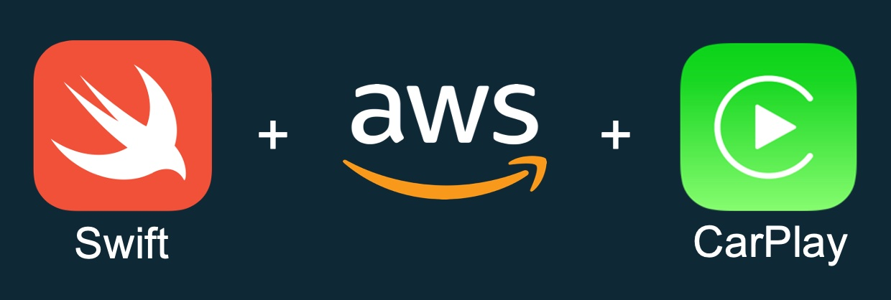

# AWS Full Stack Swift with Apple CarPlay



This application demonstrates a full-stack Apple CarPlay app that uses Swift for both the UI and the backend services in AWS.  The app implements the new [AWS SDK for Swift](https://github.com/awslabs/aws-sdk-swift) and latest features of AWS Lambda that allow you to develop and deploy functions written in Swift as Docker images.

This is important as it allows frontend developers who are proficient in Swift to leverage their skills in building out the backend of their applications.  It also enables an entire geneation of Swift engineers to build apps on AWS using their language of choice.

This sample app is useful for iOS/CarPlay developers learning how to interact with backend services running on AWS.  It is also beneficial for customers who want to build their backend infrastructure using Swift, regardless if there is an iOS front end component.  Explore the SAM portion of this project to discover how to build and deploy Swift based Lambda functions to AWS.


The application tracks the user's current location and displays the current weather, air quality, and nearby points of interest such as coffee, food, and fuel. The app also allows you to send messages from the AWS Cloud to the app which are displayed in real-time to the user.


## Architecture


1. The Apple CarPlay app is written in Swift and uses AWS Amplify libraries to communicate with services in the AWS Cloud.
2. All data is served to the client application via an AWS AppSync GraphQL API.  As the client changes its location, queries are sent via the API to obtain weather, air quality, and points of interest in the vicinity of the user.
3. The AWS AppSync GraphQL API uses Lambda functions written in Swift to interact with Amazon Location Service for points of interest.  It also communicates with a 3rd party API outside of AWS for weather and air quality. The API key for the 3rd party weather service is stored in AWS Secrets Manager.
4. The Lambda functions use the new [AWS SDK for Swift](https://github.com/awslabs/aws-sdk-swift) to interact with the AWS services!
5. The client establishes a subscription to AWS AppSync to receive real-time notifications triggered from the cloud.

## Getting Started

### **Prerequisites**
The following software was used in the development of this application.  While it may work with alternative versions, we recommend you deploy the specified minimum version.

1. An AWS account in which you have Administrator access.

2. [AWS CLI](https://docs.aws.amazon.com/cli/latest/userguide/install-cliv2.html) (^2.15.3) the AWS Command Line Interface (CLI) is used to configure your connection credentials to AWS.  These credentials are used by the AWS Serverless Application Model (SAM).

3. [Node.js](https://nodejs.org/en/download/current/) (^18.19.0) with NPM (^10.1.0)

4. [AWS Serverless Application Model (SAM)](https://docs.aws.amazon.com/serverless-application-model/latest/developerguide/install-sam-cli.html) (^1.103.0) used to generate the AWS services used by the application.

5. [IQ Air API Key](https://dashboard.iqair.com/) is a 3rd party API used to obtain weather and air quality for a specified location.  Create a free Community Edition API key.

6. [Docker Desktop](https://www.docker.com/products/docker-desktop) (^4.15) Docker is used to compile the Swift Lambda functions into a Docker image. 

7. [Xcode](https://developer.apple.com/xcode/) (^15.2) Xcode is used to build and debug the CarPlay application.  You will need iOS Simulator 17.0 enabled.

### **Installation**

The application utilizes the AWS Serverless Application Model (SAM) and Docker to compile and deploy your Swift based Lambda functions.

*Make sure you have [configured the AWS CLI](https://docs.aws.amazon.com/cli/latest/userguide/cli-configure-quickstart.html) prior to following these instructions as several steps assume you gave defined credentials for your default AWS account.*

**Clone this code repository**

```
git clone git@github.com:aws-samples/aws-serverless-fullstack-swift-apple-carplay-example.git
```

**Initialize the Backend**

First, initialize the SAM project from the public GraphQL template.
```
sam init --location gh:aws-samples/aws-sam-swift
```

Select template 3 *Serverless GraphQL API (GraphQL API using AWS AppSync and Amazon Location Service)* template.

Enter *sam* as the project name.

```bash
Select a template
    1 - Hello World (Hello World on AWS)
    2 - Serverless REST API (REST API using Amazon API Gateway and Amazon DynamoDB)
    3 - Serverless GraphQL API (GraphQL API using AWS AppSync and Amazon Location Service)
    Choose from [1/2/3] (1): 3

[1/1] project_name (Swift Graphql API on AWS): sam
```
**Build and deploy the SAM project**

The *sam build* command compiles your Swift Lambda functions and prepares your prject for deployment. SAM uses Docker on your local machine to compile the Lambda Functions.

Switch to the **sam** folder and build the project.

```
cd sam
sam build
```

The *sam deploy* command deploys your application to AWS. This includes 4 Lambda functions, an Amazon Location Place Index, and a Secrets Manager secret.

If you are deploying to a region other than *us-east-1* specify the region when prompted. Accept the default value for all other prompts.

```
sam deploy --guided
```

**Configure Secrets Manager with the IQ Air API Key**

SAM created a secret in AWS Secrets Manager to hold the IQ Air API key.  Lambda uses this secret to obtain the API Key for the IQ Air API.  Use the AWS CLI to update the secret with the API key you obtained from the IQ Air site.

Replace the values in brackets with your values:

```
aws secretsmanager put-secret-value --secret-id SwiftAPIWeatherApiKeySecret --secret-string [your IQ Air API key]
```

**Configure the Amplify Libraries**

The application uses Amplify Swift libraries to communicate with your GraphQL API. You create a configuration file for the application to use your API.

Switch to the **mobile** folder of the application:

```
cd ../mobile
```

When you deloyed the SAM application, 2 values were output at the end of the deployment.

```bash
Outputs
------------------------------------------------------------------------------------------------------------
Key                 APIEndpointValue
Description         AppSync API Endpoint
Value               [your-api-endpoint]

Key                 ApiKeyValue
Description         API Key
Value               [your-api-key]

------------------------------------------------------------------------------------------------------------
```

Pass these values, and your AWS region, to the **amplify-config.sh** script.

```bash
./scripts/amplify-config.sh \
[your-api-endpoint] \
[your-api-key] \
[region]
```

For example:

```bash
./scripts/amplify-config.sh \
https://your-api.appsync-api.us-east-1.amazonaws.com/graphql \
1234567890abcdefg \
us-east-1
```

## Run the CarPlay app

From the **mobile** folder of the application open the project in Xcode:

```
open mobile.xcodeproj
```

*Note - you can also open the project from the Xcode UI*

Once the project loads in Xcode, select an iPhone simulator from the menu bar and the "Run" arrow button to start the app.

Once the iPhone app is running in the iOS Simulator, initiate a "Freeway Drive" to simulate the user driving:


As the user's location changes:

- Select the Weather button at the bottom of the iOS app to view the weather and air quality of the current location.

- Select the Places button to view coffee, food, and fuel locations in the vicinity of the user.

- Select the Messages button to view messages sent to the user from the AWS Cloud.  Instructions for sending messages are detailed below.

If the simulator does not display the feature to simulate a Freeway Drive, ensure Location Simulation is enabled in Xcode:

From the Xcode menu select *Product -> Scheme -> Edit Scheme*

Then ensure *Core Location: Allow Location Simulation* is checked.


**Start the CarPlay simulator**

From the Simulator menu select I/O -> External Displays -> CarPlay:


When the CarPlay simulator screen launches select the AWS app:


The app will display a map with the user's current location.  Click the map to view the navbar buttons and select the Weather and Places buttons.

*Note - when selecting a location from the Places screen (Coffee, Food, or Fuel) the screen will display a navigation alert to "Go" to that location.  For this sample we have not implemented navigation functionality.  That is functionality you may want to add to your version of this app.*

**Send a real-time message to the application from AWS**

To send a message to the driver, logon to the AWS Console and navigate to the AppSync service.  From there select the **swiftcarplaylocation** API.

From the API screen select the **Run a Query** button.  Paste the following GraphQL mutation code into the middle query panel and click the orange Run arrow button

```
mutation MyMutation {
  createMessage(input: {
    text: "Pickup package", 
    recipient: "Vehicle1"}
  ) {
    id
    text
    recipient
    timestamp
  }
}
```

Console screenshot:


You should see the message delivered to both the CarPlay and iPhone apps.

## Cleanup

Once you are finished working with this project, you may want to delete the resources it created in your AWS account.  

From the **sam** folder delete the resources created by the SAM:

```
sam delete
```

## License

This sample code is made available under a modified MIT-0 license. See the LICENSE file.
